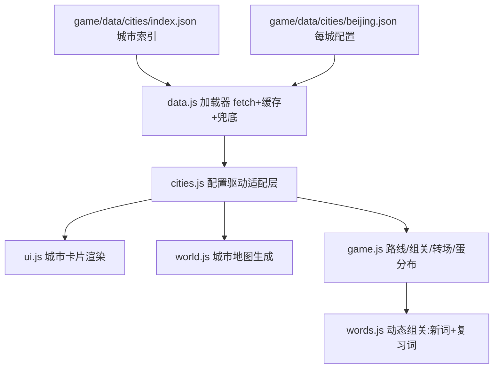

## 产品概述

词宠岛（纯前端 three.js 儿童英语学习游戏）两项大型升级：

### 一、城市内容体系重构（配置为主、程序加强）

- 城市文案、图片等资源全部外置为独立文件目录，每城一个 JSON 配置文件，不在程序中写死
- 城市介绍增加历史介绍；城市卡片使用真实特色图片（图片组、幻灯片轮播形式）
- Tab 页：大学、美食、风景名胜（架构支持扩展更多 Tab），内容以"实际图片+文字"卡片为主
- 大学：点击名称跳转官网；展示创建时间、历史、建校距今多少年（实时计算）、全球排名、全国排名
- 美食、风景名胜每城 8 个以上
- 新增台湾省重要城市：台北、高雄、台中、台南
- 首次未获取到用户城市默认成都；北京为最后一个终点城市，显示其重要性（终点徽章+抵达仪式）

### 二、关卡结构重构（纯城市链条）

- 去掉农场主岛：第一关就是家乡城市（默认成都），城市与城市之间用小火车/飞机转场动画衔接
- 每关整屏可视区域都是一座城市地图，小人可在全城到处行走
- 词宠蛋分散藏于城市各处（地标旁、街角、高台），不再排排站
- 每关词量：4~5 个不重复新词（单词与短语可混合）+ 4~5 个其他城市学过的复习词（巩固）
- 复习蛋简单模式：读一遍/选对意思即可过，重在巩固不卡人
- 所有的蛋孵化好才过关，转场到下一座城市（全新地图）；北京为终点大地图+专属仪式
- 日常玩法迁移：喂食/摸头全城通用，钓鱼码头挪到沿海城市，猫头鹰改城市向导

### 三、操作问题修复

- 点击定位 Bug：城市圈内点击金色落点圈出现在圈外（根因：落点被按世界原点半径 48 钳制，而城市岛分布在距原点 66~92 处）
- 鼠标点击：点一次走一步（固定步长），不再点一次一直走到位；移除按住持续跟随
- 鼠标滚轮与键盘缩放地图不灵活，需优化手感

## 技术栈

- 保持现有架构：纯前端 ES Modules + three.js 0.160（importmap CDN），无构建流程，静态部署
- 数据层：`game/data/cities/` 目录 JSON 文件，运行时 fetch + 内存缓存 + 失败回退内置兜底数据（不用 import 断言，兼容性差）
- 图片源：Wikimedia Commons 真实照片外链（免费许可、可热链），JSON 中 img 字段可随时替换为本地图片；onerror 回退 emoji 横幅

## 系统架构



## 关键决策

1. **数据外置**：index.json（城市索引/顺序/默认城市 chengdu/终点 beijing）+ 每城 JSON；加载失败回退内置最小数据，游戏永不因配置缺失崩溃；旧字段（unis/specialties/variants）向后兼容，旧存档路线不受影响
2. **渲染层只认配置**：cities.js 改为"加载配置+路线算法"；新增 Tab/新增城市零代码改动
3. **关卡生成配置化**：world.js 按 level 配置建城（半径 26~30、多地标组合、地图式路网、装饰分区、藏蛋点、高台）；北京专属大地图（约 3 倍面积、城楼+长城段+天坛组合）；移除农场岛/河/船/机关大门
4. **动态组关**：words.js chaptersFor 重写——每关 4~5 新词（本册单词+短语池混合去重，seed=昵称+册 保证跨会话一致）+ 4~5 复习词（从已孵化池抽取）；复习蛋挑战走简单模式分支（读一遍/选义即过）；PER_CHAPTER 改动态
5. **点击修复**：_setMoveTarget 钳制改为相对玩家当前城市中心；单击走固定步长约 2 米后停（金圈标记保留）；移除 _holdWalk 持续跟随；滚轮系数调细+键盘 +/-/[ ] 缩放+camDist 插值平滑
6. **复用已有演出**：转场复用 _flyTo cinematic + chapterBanner（"出发前往上海"+ 抵达横幅 + 北京烟花终点仪式）；通关卡/换装系统已有，直接复用

## 性能与可靠性

- JSON 按需加载（index + 当前路线城市），图片懒加载 + 幻灯片预加载下一张；建校年数前端实时计算
- window.open 官网外链带 noopener,noreferrer；触屏外链弹确认防误触
- 爆炸半径控制：save 存档兼容（已孵化集合沿用，组关变化时按 seed 重建路线不丢进度）

## 目录结构

```
game/
├── data/cities/
│   ├── index.json          # [NEW] 城市索引：id/名称/地区/顺序/默认成都/终点北京
│   ├── beijing.json        # [NEW] 北京全量（终点）：history/gallery/unis(官网+年份+排名)/foods 8+/scenes 8+/level 大地图
│   ├── chengdu.json        # [NEW] 成都全量（默认家乡）
│   ├── taipei.json         # [NEW] 台北（台湾省）
│   ├── kaohsiung.json      # [NEW] 高雄（台湾省）
│   ├── taichung.json       # [NEW] 台中（台湾省）
│   ├── tainan.json         # [NEW] 台南（台湾省）
│   └── ...                 # [NEW] 其余城市 JSON（重点城市全量，其余基础字段）
├── js/
│   ├── data.js             # [NEW] 配置加载器：fetch+缓存+兜底合并
│   ├── cities.js           # [MODIFY] 配置驱动改造，保留路线/测验算法
│   ├── words.js            # [MODIFY] 动态组关：新词+复习词混合、复习蛋简单模式标记
│   ├── world.js            # [MODIFY] 全屏城市地图生成（level 配置/多地标/路网/藏蛋点/高台），移除农场岛
│   ├── game.js             # [MODIFY] 默认成都；点击钳制相对当前城；点一下走一步；缩放优化；转场动画；北京终点仪式
│   ├── ui.js               # [MODIFY] 城市卡片重做（幻灯片/富卡片 Tab/外链）
│   └── main.js             # [MODIFY] 启动预加载城市索引与路线数据
├── css/style.css           # [MODIFY] 城市卡新样式（幻灯片/图片卡/大学卡/终点徽章）
└── index.html              # [MODIFY] 城市卡片结构微调
```

### 城市 JSON 核心契约

```
{
  "id": "beijing", "name": "北京", "en": "Beijing", "color": "#C8402F",
  "landmark": "gate", "region": "华北", "isFinal": true,
  "history": "300 字以内城市历史",
  "gallery": [ { "img": "https://upload.wikimedia.org/...", "caption": "天安门" } ],
  "unis": [ { "zh": "清华大学", "en": "...", "tag": "985", "site": "https://www.tsinghua.edu.cn",
              "founded": 1911, "globalRank": 20, "nationalRank": 1, "history": "一句话" } ],
  "foods": [ { "name": "北京烤鸭", "en": "Roast Duck", "desc": "...", "img": "..." } ],
  "scenes": [ { "name": "长城", "en": "Great Wall", "desc": "...", "img": "..." } ],
  "level": { "radius": 28, "landmarks": ["gate","wall","temple"], "paths": true,
             "eggSpots": "scatter", "districts": ["food-street","hutong","park"] }
}
```

## 设计风格

延续词宠岛现有粉彩卡通风格（圆角奶油卡片、粉彩描边、柔和投影），城市卡片全面升级：

- **顶部幻灯片图集**：16:9 大图区，真实城市照片 4 秒/张自动轮播 + 底部圆点指示器 + 左右箭头，懒加载，加载中显示城市主题色渐变占位，onerror 回退 emoji 大字横幅
- **大学 Tab**：横向卡片（校徽色条 + 校名超链接按钮 + 985/211 标签 + 信息网格：创建年份/建校 N 年实时计算高亮/全球排名/全国排名 + 一句话历史）
- **美食/风景 Tab**：双列图片卡片网格，实拍图 + 名称 + 中英文简介，触屏友好大点击区，hover 微浮起 + 点击轻震动
- **可扩展 Tab**：Tab 栏由配置数组渲染，JSON 新增 customTabs 自动出现
- **北京终点仪式**：全屏横幅"抵达首都北京"+ 烟花粒子 + 金色主题卡片描边 + "终点站"徽章
- **转场动画**：城市间全屏横幅（小火车/飞机图标 + "前往上海…"）+ 镜头 cinematic 飞行衔接

## Agent Extensions

### Skill

- **agent-browser**
- Purpose: 本地起服后自动化验证全链路（城市卡幻灯片/Tab 渲染、外链、点击落点在圈内、单击走一步、城市大地图、转场、新/复习蛋混合）
- Expected outcome: 截图确认各功能正常、无控制台报错，验证通过后提交