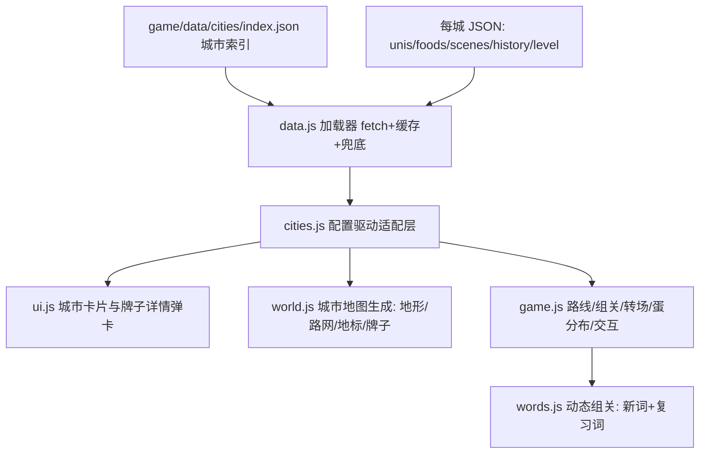

## 产品概述

词宠岛（纯前端 three.js 儿童英语学习游戏）大型升级：城市内容配置化 + 关卡重构为“纯城市链条 + 城市牌子探索”模式

## 一、城市内容体系（配置为主、程序加强）

- 文案、图片等资源全部外置：`game/data/cities/` 目录，每城一个 JSON 配置文件，程序不写死内容
- 城市介绍含历史；城市卡片顶部真实特色图片幻灯片轮播
- Tab 页：大学、美食、风景名胜（架构支持扩展更多 Tab），内容为“实际图片+文字”卡片
- 大学：点击名称跳官网、创建时间、历史、建校距今年数（实时计算）、全球/全国排名
- 美食、风景名胜每城 8 个以上
- 新增台湾省台北、高雄、台中、台南
- 首次未获取用户城市默认成都；北京为终点城市（终点徽章+抵达仪式）

## 二、关卡结构重构（纯城市链条 + 牌子探索）

- 去掉农场岛：第一关=家乡城市（默认成都），城市间小火车/飞机转场动画
- 每关整屏可视区域是一座城市地图，小人全城可走
- **牌子系统（本轮新增）**：城市地图上按大致真实地理方位分布大学、美食、风景名胜的牌子（一块城市几十块）；点击牌子弹出详细介绍（图片+文字，数据来自 JSON）；牌子与蛋解耦——不是每块牌旁都有蛋
- 词宠蛋控制在 12 颗左右（不超过 15）：一部分 seed 挑选放在牌子旁，其余散布全城（地标旁/街角/高台）
- 每关词量：约 6 个新词（单词+短语混合、不重复）+ 约 6 个复习词（之前城市学过，seed 稳定跨会话一致）；复习蛋简单模式（读一遍/选义即过）
- 全部蛋孵化 → 过关 → 转场下一城（全新地图）→ 北京终点大地图+仪式
- 日常玩法迁移：喂食/摸头全城通用，钓鱼挪沿海城市，猫头鹰改城市向导

## 三、操作修复

- 城市圈内点击金色落点圈出现在圈外（根因：落点按世界原点半径 48 钳制，城市岛分布在 66~92 处）
- 点一次走一步（固定步长约 2 米），移除按住持续跟随
- 滚轮/键盘缩放手感优化

## 技术栈

- 保持现有架构：纯前端 ES Modules + three.js 0.160（importmap CDN），无构建流程，静态部署（game/ 复制根目录）
- 数据层：`game/data/cities/` JSON，运行时 fetch + 内存缓存 + 失败回退内置兜底（不用 import 断言，兼容性差）
- 图片源：Wikimedia Commons 真实照片外链（免费可热链），img 字段可随时换成本地图片；onerror 回退 emoji 横幅

## 系统架构

## 关键决策

1. **数据外置**：index.json（顺序/默认 chengdu/终点 beijing）+ 每城 JSON；加载失败回退内置最小数据永不崩；旧字段向后兼容，旧存档不受影响
2. **牌子系统**：JSON 中 unis/foods/scenes 各项自动生成牌子，每项带 `bearing` 方位（N/NE/E/SE/S/SW/W/NW，未配置时按 id hash 自动分布），同方位多条目按半径错开；低模立牌=杆+板+emoji 图标+中文名 sprite；牌子只入遮挡不入碰撞（几十块牌不挡路）；点击牌子→详情弹卡（复用城市卡样式，图片+中英文+简介，靠近可发音朗读名称）
3. **蛋与牌子解耦**：level 配置 eggCount≈12（上限 15）；seed 按"昵称+册"从本城牌子中挑 4~6 块旁置蛋，其余按散布点位放置；蛋对应本关词表（新词+复习词）
4. **动态组关**：words.js chaptersFor 重写——新词约 6（本册单词+短语池混合去重）+复习词约 6（已孵化池 seed 抽取）；复习蛋走简单模式分支；PER_CHAPTER 动态化；save 孵化池兼容
5. **关卡生成配置化**：world.js 按 level 配置建城（半径 28~32、多地标、地图式路网复用现有路面画法、装饰分区、高台、牌子层）；移除农场岛/河/船/机关；北京大地图+终点仪式；转场复用 _flyTo cinematic + chapterBanner
6. **操作修复**：点击钳制相对当前城市中心；单击走一步移除 _holdWalk；滚轮系数调细+键盘 +/-/[ ] 缩放+camDist 插值平滑

## 性能与可靠性

- JSON 按需加载（index+当前路线城市）；图片懒加载+幻灯片预加载下一张；建校年数前端实时计算
- 官网外链 window.open 带 noopener,noreferrer；触屏外链弹确认防误触
- 牌子用 sprite+简单几何体，几十块/城的渲染开销可控（共享材质、视距裁剪）

## 设计风格

延续词宠岛粉彩卡通风格（圆角奶油卡片、粉彩描边、柔和投影），升级点：

- **城市卡片**：顶部 16:9 幻灯片图集（真实照片 4 秒/张轮播+圆点指示器+左右箭头，加载中显示城市主题色渐变占位，onerror 回退 emoji 横幅）；Tab 栏配置化渲染；大学 Tab 横向富卡片（校名超链接+985/211 标签+信息网格：创建年份/建校 N 年实时计算高亮/全球全国排名+一句话历史）；美食/风景双列图片卡片网格，hover 微浮起+点击轻震动
- **3D 牌子**：低模立牌（木杆+圆角板+类别 emoji 图标+中文名 sprite），颜色按类别区分（大学蓝/美食橙/风景绿），按方位绕城分布，同方位错开半径；点击弹详情卡（复用城市卡样式：图片+中英文名+简介+百科式短文）
- **北京终点**：金色主题卡片描边+“终点站”徽章+抵达横幅“抵达首都北京”+烟花粒子
- **转场**：全屏横幅（小火车/飞机图标+“前往上海…”）+镜头 cinematic 飞行
- **蛋**：12 颗左右散布+牌子旁，光柱引导保留

## Agent Extensions

### Skill

- **agent-browser**
- Purpose: 本地起服后自动化验证全链路（城市卡幻灯片与各 Tab、牌子点击弹卡、点击落点在圈内、单击走一步、蛋分布、转场、北京终点仪式）
- Expected outcome: 截图确认各功能正常、无控制台报错，验证通过后中文规范化提交