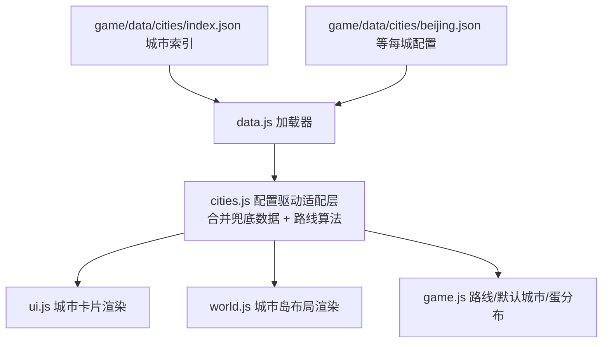

## 需求总结

### 一、城市内容体系重构（配置为主、程序加强）

- 城市文案、图片等资源全部外置为独立文件目录结构，不在程序中写死；每城一个 JSON 配置文件
- 城市介绍增加历史介绍（中文，可扩展英文）
- 扩展城市：新增台湾省台北、高雄、台中、台南等重要城市
- 首次未获取到用户城市时默认成都；北京为最后一个终点城市，需突出其重要性
- 城市卡片使用真实特色图片：图片组、幻灯片形式展示
- Tab 页：大学、美食、风景名胜（架构上支持扩展更多 Tab），内容以“实际图片 + 文字”卡片为主
- 大学：点击大学名称跳转官网；展示创建时间、历史、建校距今多少年（实时计算）、全球排名、全国排名
- 美食：每城 8 个以上
- 风景名胜：每城 8 个以上

### 二、关卡与操作问题

- 北京关卡太小太无趣（小圆圈、几个蛋排一排），需要更大的地图和更有趣的布局，其他城市同类问题一并解决
- 点击定位 Bug：在城市圈内点击，金色落点圈出现在圈外
- 鼠标左键点击地图：点一次走一步（固定步长），不再点一次一直走到位
- 鼠标滚轮与键盘缩放不灵活，需优化手感

## 技术方案

### 技术栈

- 保持现有纯前端 ES Modules + three.js 0.160（importmap CDN），无构建流程
- 数据层：`game/data/cities/` 目录 + 运行时 fetch JSON + 内存缓存 + 失败回退内置兜底数据

### 系统架构



### 关键决策

1. **数据外置**：新增 `game/data/cities/`（index.json + 每城一个 JSON）。用 fetch 而非 import（纯静态部署无构建，import JSON 断言兼容性差）。加载器带缓存与兜底：JSON 缺字段或加载失败时回退 cities.js 内置最小数据，游戏永不因配置缺失而崩
2. **图片源**：Wikimedia Commons 真实照片外链（免费许可、可热链、稳定），JSON 中每项带 img 字段可随时替换为本地图片；`onerror` 回退 emoji 横幅，断网也不白屏
3. **渲染层只认配置**：cities.js 改造为“加载配置 + 路线算法”，world.js/ui.js/game.js 不再读硬编码字段，新增 Tab / 新增城市零代码改动
4. **点击 Bug 根因**：`_setMoveTarget` 把落点按世界原点钳制在半径 48 内，而城市岛分布在距原点 66~92 处，圈内点击必被拉到圈外。修复为相对“玩家当前所在岛中心”钳制
5. **点一下走一步**：单击/轻点改为朝点击方向走固定步长约 2 米后停（金圈标记保留作为方向指示）；移除按住左键持续跟随 `_holdWalk`；连续移动仍走摇杆/WASD（不影响已有习惯）
6. **北京终点仪式**：北京岛半径加大（约 24，其他城 16~18），多地标组合（城楼 + 长城段 + 天坛样式），抵达时专属横幅“抵达首都北京” + 烟花 + 特殊文案

### 实施要点

- **性能**：JSON 按需加载（进入游戏拉 index + 当前路线涉及的城市），图片懒加载 + 幻灯片预加载下一张；大学建校年数前端实时计算（`new Date().getFullYear() - founded`）
- **兼容**：window.open 打开大学官网用 `noopener,noreferrer`；触屏设备外链弹确认提示（防误触离开游戏）
- **爆炸半径控制**：城市数据迁移保持字段向后兼容（unis/specialties/variants 旧字段保留），旧存档路线不受影响

### 目录结构

```
game/
├── data/
│   └── cities/
│       ├── index.json                  # [NEW] 城市索引：id/名称/地区/顺序/默认城市(chengdu)/终点城市(beijing)
│       ├── beijing.json                # [NEW] 北京全量：history/gallery/大学(官网+年份+排名)/美食8+/风景8+/level布局
│       ├── chengdu.json                # [NEW] 成都全量（默认家乡城市）
│       ├── taipei.json                 # [NEW] 台北（台湾省）
│       ├── kaohsiung.json              # [NEW] 高雄（台湾省）
│       ├── taichung.json               # [NEW] 台中（台湾省）
│       ├── tainan.json                 # [NEW] 台南（台湾省）
│       └── ...                         # [NEW] 其余城市基础 JSON（分批迁移）
├── js/
│   ├── data.js                         # [NEW] 配置加载器：fetch+缓存+兜底合并，暴露 loadCityData/loadCityIndex
│   ├── cities.js                       # [MODIFY] 改为配置驱动：删除硬编码城市详情，保留路线算法/测验/兜底数据
│   ├── game.js                         # [MODIFY] 默认城市成都；点击钳制相对当前岛；点一下走一步；键盘/滚轮缩放；北京抵达仪式
│   ├── world.js                        # [MODIFY] 城市岛布局读取 level 配置（半径/多地标/路径环线/装饰分区/藏蛋点）
│   ├── ui.js                           # [MODIFY] 城市卡片重做：幻灯片图集 + 富卡片 Tab + 外链跳转
│   └── main.js                         # [MODIFY] 启动时预加载城市索引与路线城市数据
├── css/style.css                       # [MODIFY] 城市卡片新样式（幻灯片/图片卡片/大学卡）
└── index.html                          # [MODIFY] 城市卡片结构微调（图集容器）
```

### 城市 JSON 结构（核心契约）

```
{
  "id": "beijing", "name": "北京", "en": "Beijing", "color": "#C8402F",
  "landmark": "gate", "region": "华北", "isFinal": true,
  "history": "（300字以内城市历史）",
  "gallery": [ {"img": "https://upload.wikimedia.org/...", "caption": "天安门"} ],
  "unis": [ {"zh": "清华大学", "en": "...", "tag": "985", "site": "https://www.tsinghua.edu.cn",
             "founded": 1911, "globalRank": 20, "nationalRank": 1, "history": "一句话"} ],
  "foods": [ {"name": "北京烤鸭", "en": "Roast Duck", "desc": "...", "img": "..."} ],
  "scenes": [ {"name": "长城", "en": "Great Wall", "desc": "...", "img": "..."} ],
  "level": { "radius": 24, "landmarks": ["gate","wall-section","temple"],
             "paths": true, "eggSpots": "scatter" }
}
```

## 城市卡片视觉重设计（游戏内弹层 UI，保持词宠岛粉彩卡通风格）

- **顶部幻灯片图集**：卡片顶部 16:9 大图区，真实城市照片自动轮播（4 秒/张）+ 底部圆点指示器 + 左右箭头，图片懒加载，加载中显示城市主题色渐变占位，onerror 回退 emoji 大字横幅
- **大学 Tab**：每所大学一张横向卡片（校徽色条 + 校名超链接按钮 + 985/211 标签 + 信息网格：创建年份/建校 N 年(实时计算高亮)/全球排名/全国排名 + 一句话历史），点击校名新窗口打开官网
- **美食/风景 Tab**：双列图片卡片网格，实拍图 + 名称 + 中英文简介，触屏友好大点击区；条目数据全由 JSON 驱动
- **可扩展 Tab**：Tab 栏由配置数组渲染，JSON 中新增 customTabs 即自动出现（如“历史”“交通”）
- **北京终点仪式**：抵达北京时全屏横幅“抵达首都北京”配烟花粒子与专属金色主题卡片描边，卡片标题带“终点站”徽章
- 交互：所有图片卡片 hover 微浮起 + 点击轻震动反馈；整体沿用现有圆角奶油卡片、粉彩描边、柔和投影的设计语言

## Agent Extensions

### Skill

- **agent-browser**
- Purpose: 本地起服后自动化验证全链路（城市卡片幻灯片/Tab 渲染、外链点击、点击落点相对岛钳制、点一下走一步、北京大地图、缩放手感）
- Expected outcome: 截图确认各 Tab 图片卡片与幻灯片正常、点击圈内落点在圈内、单击仅走一步、无控制台报错